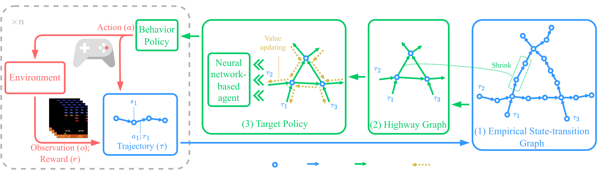
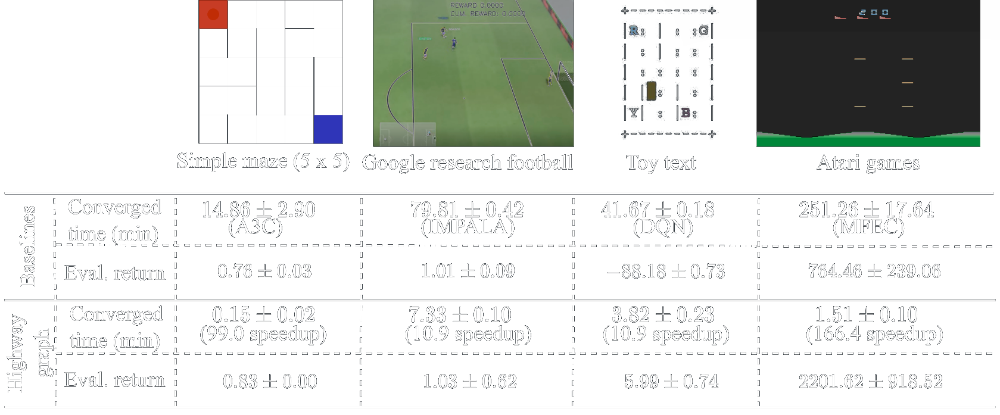

# HighwayRL

[]([https://arxiv.org/abs/1234.56789](https://arxiv.org/abs/2405.11727))

This is the official PyTorch implementation of the Highway RL method proposed by our paper "[Highway Graph to Accelerate Reinforcement Learning](https://arxiv.org/abs/2405.11727)". 

The high cost of training RL agents has limited their research and applications.
We explored an approach to significantly reduce this cost by applying the concept of highways in real-world transportation systems to the value-updating process of RL algorithms, introducing the highway RL method.



Figure 1. Overall data flow of our highway graph RL method. The actor (on the left) sends the sampled transitions by the behavior policy to the learner (on the right) which (1) constructs the empirical state-transition graph with rewards; (2) converts the empirical state-transition graph to the corresponding highway graph; (3) updates the value of state-actions in the highway graph by an improved value iteration algorithm and re-parameterize the highway graph to a neural network-based agent as the new behavior policy.



Figure 2. A comparison of converged time of training (within one million frames) and corresponding speedups by the highway graph compared to baselines.
The first row of images are example states from each environment.
The results demonstrate a 10 to more than 150 times faster RL agent training with higher evaluation return when adopting the highway graph.
All the experiments were performed on the same machine with a 12-core CPU and 128 GB Memory.


## How to run the code

All experiments can be conducted within a docker container.
Before you can run and see the results, you need to obtain the image with all decencies installed.
Please see the following for more details.

### 1. Prerequisite
A Docker with the Nvidia GPU accessible should be on the Linux distribution. 
The tested Linux distributions are Ubuntu 22.04 LTS and Fedora 39, and the docker version is 24.0.5. 

### 2. Build or pull the docker image
The docker image with dependencies and RL environment setup is required.
One could build the docker image locally by:

    sudo docker image build docker/ml/pt_0.2 --tag meetingdocker/ml:pt_0.2 --build-arg UID=$(id -u)
    sudo docker image build docker/rl/pt_0.2 --tag meetingdocker/rl:pt_0.2

or download the built image when running the code.
 
### 3. Run the code

    ./run.sh

## Changing the running setups
All source files (in the `src` folder) are organized by the structure of levels:

`app-level`: top level of the code, defining the overall running logic of the application.

`module-level`: middle level for all components of the application.

`util-level`: tools and utilities used by modules at the bottom level.

In the `module-level`, `context.py` acts as the control panel for experiment setup.
The class `Context` is the structure to store the default value of options, which can be specified and overridden by the class `Profile`.
A customized profile can be done by editing and adding the option with a value you desire.
Finally, the `run.sh` file gives the ability to set the RL environmental information of the experiments.


## Bibtex
```
@misc{yin2024highway,
      title={Highway Graph to Accelerate Reinforcement Learning}, 
      author={Zidu Yin and Zhen Zhang and Dong Gong and Stefano V. Albrecht and Javen Q. Shi},
      year={2024},
      eprint={2405.11727},
      archivePrefix={arXiv},
      primaryClass={cs.LG}
}
```
